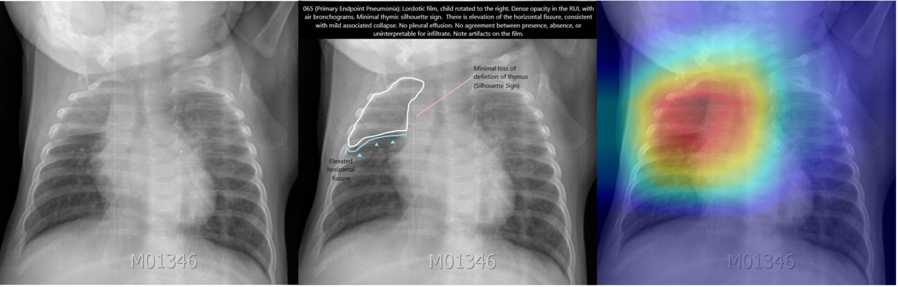
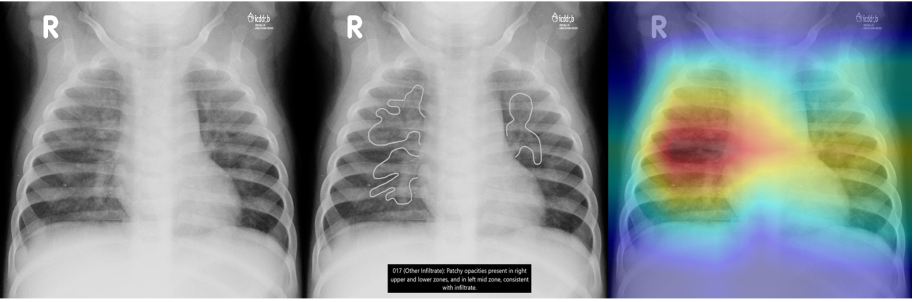

# PERCH-CXR


 <a href="https://apps.who.int/iris/bitstream/handle/10665/66956/WHO_V_and_B_01.35.pdf;jsessionid=BBBC54AAF1AC3A4330B6B0C39914412A?sequence=1">Primary endpoint pneumonia (<strong>PEP</strong>)</a> along with non-endpoint/other infiltrates (<strong>OI</strong>), and <strong>non-PEP/OI</strong> are defined by the World Health Organization (WHO) as endpoints of evaluation in vaccine effectiveness studies among pediatric population. This is a tool to detect these endpoints on pediatric chest radiograph, written in <strong> TensorFlow 2.2</strong>. The original study was published on [preprint link to be added].

The model was built on <a href="https://arxiv.org/abs/1608.06993">DenseNet121</a> and trained on images from the <a href="https://academic.oup.com/cid/article/64/suppl_3/S253/3858215"> Pneumonia Etiology Research for Child Health (PERCH)</a> study. 
The project also used <a href="https://stanfordmlgroup.github.io/competitions/chexpert/">CheXpert</a> dataset for pretraining, and images from <a href="https://pubmed.ncbi.nlm.nih.gov/15976876/">WHO-original</a> and <a href="https://www.ncbi.nlm.nih.gov/pmc/articles/PMC5608771/">WHO-CRES (Chest Radiography in Epidemiological Studies)</a> for testing.

<strong>Disclaimer:</strong> The definition is designed to be used in epidmiological studies which typically favors <strong>specificty</strong> over sensitivity, and thus is not meant to be used for clinical diagnosis where a higher sensitivity is preferred to reduce under-diagnosis. <a href="https://pubmed.ncbi.nlm.nih.gov/21870077/">Some researchers</a> have recommended dropping OI category from the WHO definition due to its low inter-rater agreement.

## Visualization
 ### Primary Endpoint Pneumonia
<details>
  <summary>Click to expand</summary>  
  

Frontal radiographs of the chest in a child with WHO-defined primary endpoint pneumonia; the child is rotated to the right with dense opacity in the right upper lobe; the model localizes consolidation with a predicted probability p = 0.980; the discriminative visualization shows fine-grained features important to the predicted class.
</details>

### Non-Endpoint/Other Infiltrate

<details>
  <summary>Click to expand</summary>


Frontal radiograph of the chest presents patchy opacity consistent with non-endpoint infiltrate. The model correctly classifies the image as infiltrate with a probability of p = 0.917 and localizes the areas of opacity. The class discriminative visualization highlights important class features.
</details>

## User Tutorial
### File Structure:
The folder [WHO_images](./WHO_images) contains a toy sample of 9 randomly selected images (3 PEP, 3 OI, and 3 non-PEP/OI) from the WHO-CRES dataset.
The folder [saved_model](./saved_model) contains a pre-trained weight file from the PERCH-CXR study.

### Step by Step Instructions:
<strong>Note:</strong> The instructions work for the toy sample right out of the box. For training on your own data, modify the parameters in ```config.ini```, and structure the data csv file as is in [WHO_CRES.csv](./WHO_images/WHO_CRES.csv), with first column containing path to each image, and second onward column containing image labels.

1. Run ```python generate_tfreocrd.py``` to transform data into <a href="https://www.tensorflow.org/tutorials/load_data/tfrecord">TFRecords</a> file, an optional format for TensorFlow, recommended for working large dataset.
2. Run ```python train.py``` to train and evaluate the model.
3. Run ```python test.py``` to test the model.
4. Run ```python grad-cam.py``` to visualize model's prediction using <a href="https://arxiv.org/abs/1610.02391">Grad-CAM</a>.

### Config.ini File Explanation
- The ```[DATA]``` section contains a ```sharding``` parameter. Sharding is recommended if you want a more thoroughly shuffled dataset (See <a href="https://www.moderndescartes.com/essays/shuffle_viz/">"How to shuffle in TensorFlow"</a>). 
- If you want to train the model using n-fold cross-validation, set ```n_fold```>1. 
- The ```[TRAIN]``` section contains a ```class_names``` parameter. Its order corresponds to the order of outcome columns in the data csv file and determines the order of model outputs. If you are evaluating your pre-trained weight in a new dataset, remember to sort the outcome columns in your data csv file according to the ```class_names```.

## Author
Star Chen (starchen1440@gmail.com)

## Acknowledgment
The study is sponsored by <a href="https://www.merck.com/">Merck & Co., Inc.</a>

## License
MIT
  
